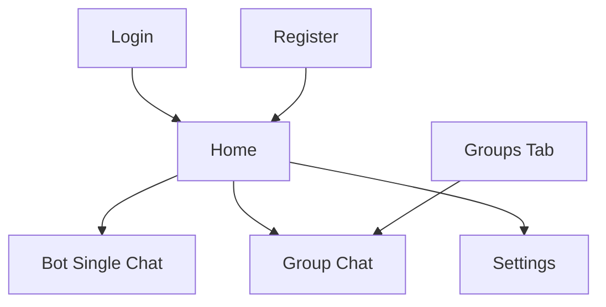
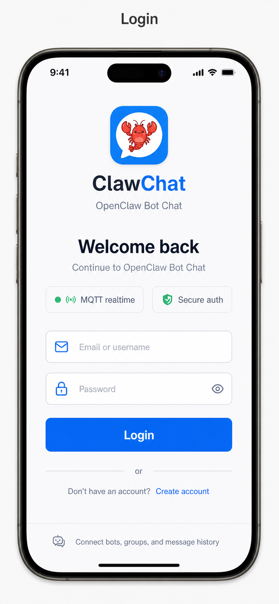
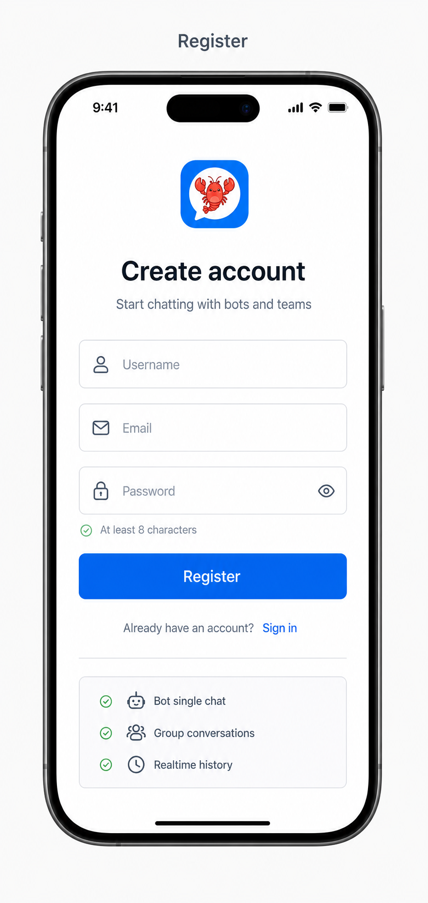
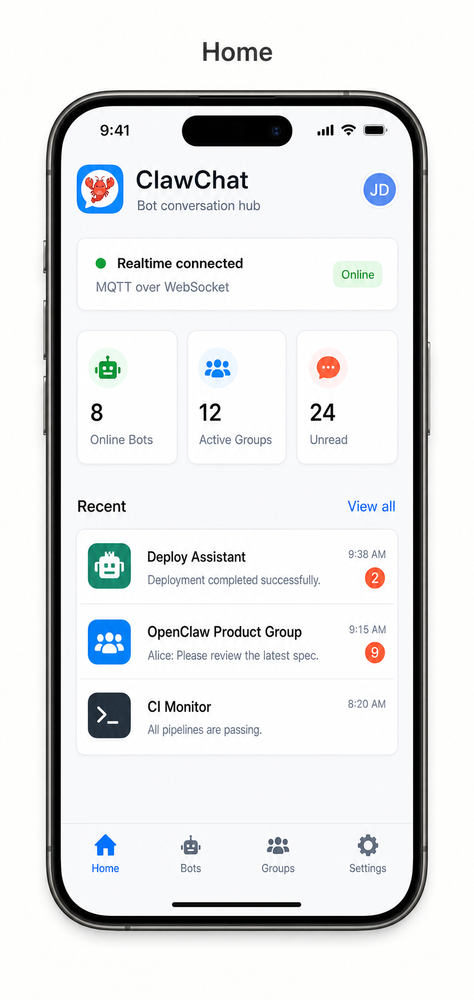
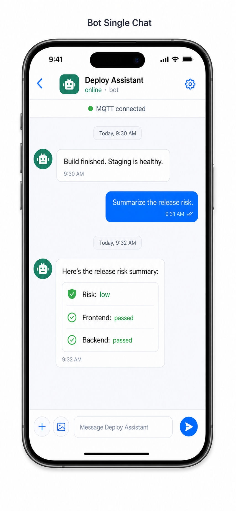
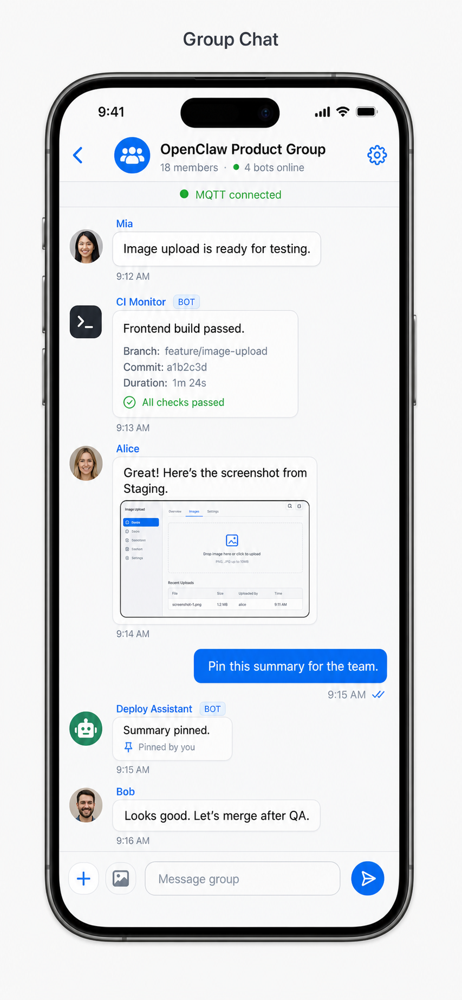
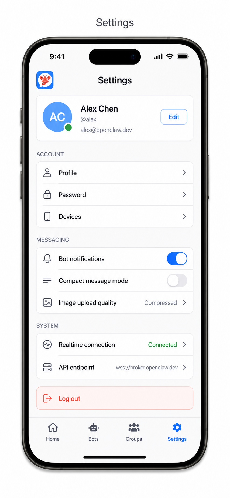

# ClawChat iOS UI Prototype

This document is the visual implementation brief for the ClawChat iOS app. It uses one generated prototype image per page so an implementation agent can translate the design into SwiftUI without guessing the main layout.

Important: the generated images may approximate the logo visually, but the implementation must use the existing app asset at `clawchat-ios/clawchat/Assets.xcassets/AppLogo.imageset/lobster_icon.png`. Do not redesign, redraw, recolor, or replace the logo.

## Design Direction

ClawChat should feel like a compact, professional messaging tool for humans and bots, not a marketing landing page. The first screen after login should immediately expose the working surface: realtime status, bot conversations, group activity, unread state, and account controls.

The UI language is modern iOS with restrained SaaS density:

- Background: cool off-white / slate gray, never dark or decorative.
- Primary action: logo-matching blue.
- Status: green for online, connected, healthy.
- Attention: coral only for unread badges, errors, and logout.
- Shape: 8px-style cards and controls where practical.
- Typography: iOS system type, clear hierarchy, compact labels.
- Navigation: tab bar for top-level surfaces; pushed chat screens hide the tab bar.

## Navigation Map

## 1. Login

Purpose: fast return path for existing users.

Implementation notes:

- Use the existing `AppLogo` asset near the top.
- Keep the login form vertically centered but not hero-like.
- Inputs should support username or email plus password.
- Primary action is one full-width blue button.
- Secondary action links to Register.
- Trust chips should be compact; they are supporting context, not marketing copy.

## 2. Register

Purpose: new-account creation with a concise explanation of what the account unlocks.

Implementation notes:

- Use the same logo treatment as Login.
- Fields: username, email, password.
- Include password helper text instead of a large instructional block.
- Include a small capability checklist: bot single chat, group conversations, realtime history.
- Secondary action links back to Login.

## 3. Home

Purpose: the authenticated landing surface and daily operating dashboard.

Implementation notes:

- Header should show `AppLogo`, app name, short subtitle, and profile affordance.
- Realtime status card should be visible in the first viewport.
- Metrics are compact cards: online bots, active groups, unread messages.
- Recent list should mix bot and group rows with clear icon differences.
- Bottom tabs: Home, Bots, Groups, Settings. Home is selected here.
- Do not make this screen a marketing hero; prioritize scan speed.

## 4. Bot Single Chat

Purpose: direct one-to-one chat between the current user and one bot.

Implementation notes:

- This page was missing from the earlier rough board and is required.
- Navigation title should be the bot name, with `online · bot` as subtitle.
- Use a bot avatar/icon distinct from human avatars.
- Incoming bot messages are left aligned; outgoing user messages are blue and right aligned.
- Bot responses may contain structured cards/checklists inside the bubble area.
- Composer supports attachment/image, multiline text, and send.
- The tab bar should be hidden on this pushed chat screen.

## 5. Group Chat

Purpose: multi-participant conversation with humans and bots in the same room.

Implementation notes:

- Navigation title should be the group name.
- Subtitle should include member count and bot presence.
- Group messages must show sender names.
- Bot messages should include a small `BOT` pill so they are distinguishable.
- Include image message treatment because the current app supports image upload/preview.
- Composer should expose plus/photo affordances, text input, and send.
- The top-right group settings icon opens member and bot management.

## 6. Settings

Purpose: profile, account security, messaging preferences, system state, and logout.

Implementation notes:

- Profile card shows avatar initials or uploaded avatar, name, username/email, and edit action.
- Account section: profile, password, devices.
- Messaging section: bot notifications, compact mode, image upload quality.
- System section: realtime connection and API endpoint.
- Logout is visually destructive and uses coral.
- Settings is selected in the bottom tab bar.

## Implementation Guardrails

- Preserve the current logo asset exactly.
- Keep the broker-first model visible through labels like MQTT, realtime connected, bot status, and group bot presence.
- Prefer reusable SwiftUI primitives: `StatusCard`, `MetricCard`, `ConversationRow`, `ChatBubble`, `SettingsRow`, `PrimaryButton`.
- Avoid adding large explanatory text inside the app. The UI should be self-evident through hierarchy and labels.
- Treat generated text in images as reference copy, not exact production strings. Real implementation should use localized, concise strings.
- Validate on small iPhone widths so row text, chips, buttons, and tab labels do not collide.
