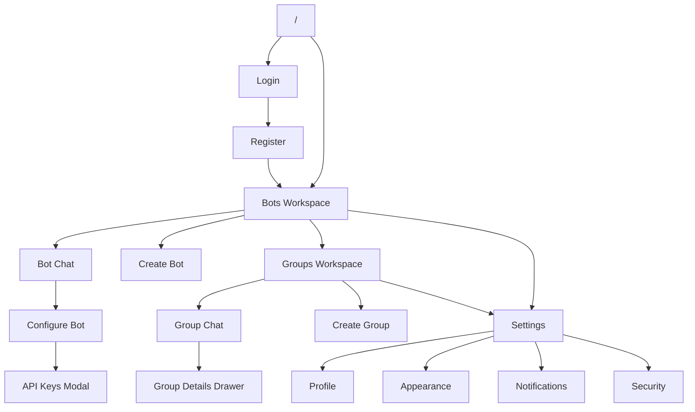
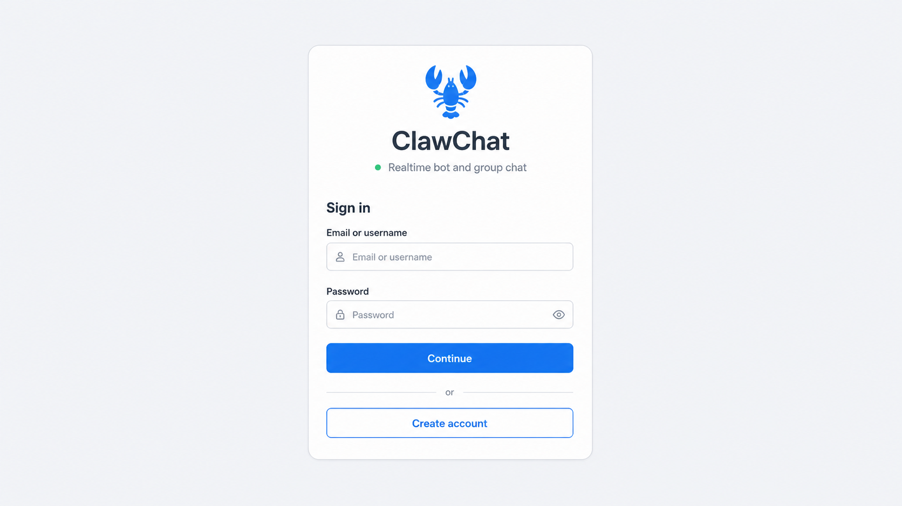
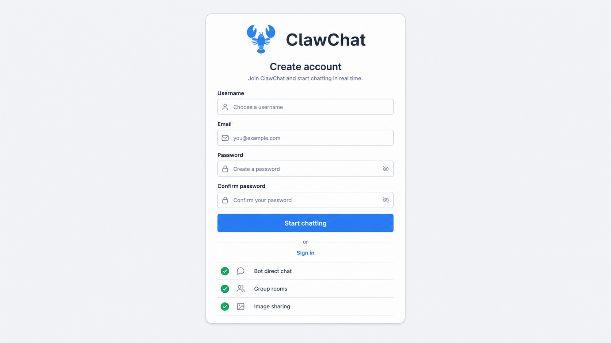
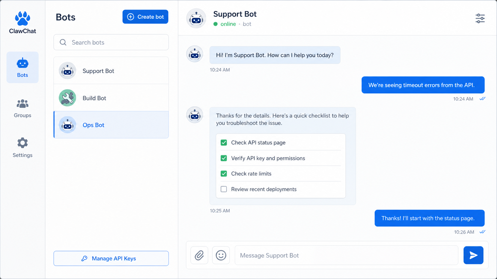
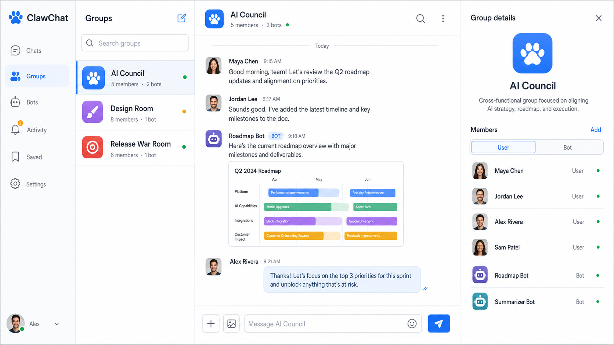
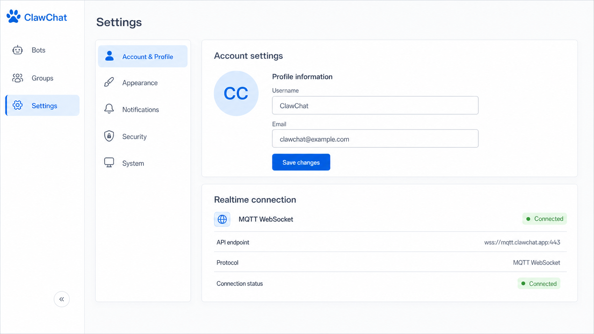

# ClawChat Web UI Prototype

This document is the visual implementation brief for the ClawChat web app. It translates the iOS prototype direction into a desktop-first, responsive web working surface for realtime human and bot messaging.

The web UI should feel like a compact, professional messaging console. It is not a marketing site and should not open with a hero section. After authentication, the first useful surface should expose conversations, bot presence, group activity, realtime state, and account controls with as little navigation friction as possible.

Important: use the existing ClawChat logo asset where a brand mark is needed. Do not redesign, redraw, recolor, or replace the logo. Current implementation files use a placeholder mark in `frontend/src/components/AppLayout.tsx`; the prototype direction is to replace that placeholder with the real app logo.

## Evidence Reviewed

- iOS prototype brief: `docs/design/ios-ui-prototype/README.md`
- Web routes: `frontend/src/app/login/page.tsx`, `frontend/src/app/register/page.tsx`, `frontend/src/app/bots/page.tsx`, `frontend/src/app/groups/page.tsx`, `frontend/src/app/settings/page.tsx`
- Shared layout: `frontend/src/components/AppLayout.tsx`
- Chat primitives: `frontend/src/components/Chat/ConversationItem.tsx`, `frontend/src/components/Chat/MessageBubble.tsx`, `frontend/src/components/Chat/ChatInput.tsx`
- Theme and token surface: `frontend/src/app/globals.css`, `frontend/tailwind.config.ts`

## Design Direction

ClawChat web should feel like a restrained SaaS chat workspace for operators who talk to bots and people throughout the day.

- Background: cool off-white / slate gray, with subtle glass only where it improves depth.
- Primary action: logo-matching blue / sky.
- Status: green for connected, online, healthy, or completed.
- Attention: coral or red only for destructive actions, failed sends, and important error states.
- Shape: compact 8-12px radii for standard controls; avoid oversized rounded cards in dense panes.
- Typography: Inter/system sans by default, compact labels, clear section hierarchy, no decorative display type.
- Navigation: persistent desktop icon rail; mobile bottom rail or compact top/back navigation where space requires it.
- Density: favor readable operational density over spacious marketing composition.

## Navigation Map

## Layout Model

Desktop web is a workspace, not a stack of mobile screens.

- Column 1: fixed global navigation rail with logo, Bots, Groups, Settings, user avatar, and logout.
- Column 2: active collection list such as bot list, group list, or settings section list.
- Column 3: primary working area such as chat, create/edit form, or settings detail.
- Column 4: optional contextual drawer for group details, members, and bot/user management.

Mobile should collapse to one primary pane at a time:

- Collection list first for Bots and Groups.
- Selecting a row switches to the chat/detail pane.
- Back affordance returns to the list.
- Drawers become full-height overlays.
- Composer remains reachable above the safe area and must not be hidden behind browser chrome.

## 1. Login

Purpose: fast return path for existing users.

Prototype requirements:

- Center a compact auth card on a quiet cool-gray background.
- Place the app logo and `ClawChat` brand above the form, not just a generic welcome heading.
- Fields: email or username, password.
- Primary action: full-width blue `Sign in`.
- Secondary action: link to Register.
- Error state appears inline above fields and should not shift the full page dramatically.
- Avoid large trust chips or marketing content; at most one short line that reinforces realtime bot chat.

Desktop notes:

- Card max width should stay around 400-440px.
- Keep vertical centering, but leave enough top/bottom breathing room for browser toolbars.

Mobile notes:

- Use full-width card rhythm with 16px page padding.
- Inputs and buttons should meet touch target expectations.

## 2. Register

Purpose: account creation for a new human user.

Prototype requirements:

- Use the same logo treatment as Login.
- Fields: username, email, password, confirm password.
- Include concise password helper text and field-level validation.
- Primary action: full-width blue `Create account`.
- Secondary action: link back to Login.
- A short capability checklist can appear below the header or footer: bot direct chat, group rooms, image sharing, realtime history.

Implementation notes:

- Keep the form compact. Do not turn registration into an onboarding page.
- Validate long words and email strings so they wrap or truncate cleanly on small screens.

## 3. Bots Workspace

Purpose: default authenticated web surface for direct bot conversations and bot management.

Prototype requirements:

- Global nav rail highlights Bots.
- Bot list pane includes title, create button, search input, and conversation rows.
- Rows show bot avatar, bot name, description or latest message, and status/unread treatment when available.
- Empty state offers `Create bot` without taking over the whole workspace.
- Primary pane shows selected bot chat, create/edit form, or a calm select-a-bot placeholder.
- Header for a selected bot includes avatar, bot name, `online · bot` or connection state, and a configure icon.
- Chat messages follow the existing direction: user bubbles right and blue, bot bubbles left and light sky/slate.
- Composer supports text, emoji, stickers, image upload, mentions where relevant, multiline input, pending upload/sending state, and disabled state.

Bot management:

- Create/edit form fields: display name and bot personality/description.
- Editing exposes `Manage API Keys`.
- API key modal includes runtime ID, active keys, create key, one-time secret reveal, and revoke action.
- Key and runtime ID copy affordances should be explicit icon buttons with tooltips.

Desktop layout:

- Navigation rail: 72px wide.
- Bot list: about 300-340px wide.
- Chat pane: fills remaining width.
- Preserve list and chat simultaneously at tablet/desktop widths.

Mobile layout:

- Start on bot list.
- Open chat replaces list.
- Header back control returns to list.
- Create/edit form uses a single-column layout with sticky action row if content grows.

## 4. Groups Workspace

Purpose: multi-participant conversations containing humans and bots.

Prototype requirements:

- Global nav rail highlights Groups.
- Group list pane mirrors Bots: title, create button, search, rows.
- Rows show group avatar, name, description/latest message, member count/unread state when available.
- Primary pane shows selected group chat, create form, or select-a-group placeholder.
- Group chat header includes avatar, group name, member count, bot presence count when available, and a group details icon.
- Group messages show sender names for incoming messages.
- Bot messages must show a small `BOT` indicator or role line so bots are distinguishable from humans.
- Image messages should be visually supported because the current chat input and bubble components support uploads.
- Mentions should be discoverable through the composer suggestion list.

Group details drawer:

- Drawer opens from the right on desktop and full-screen on mobile.
- Include group avatar, name, description, member list, roles, and bot/human distinction.
- Owner controls include add user/bot and future remove/manage affordances.
- Use a segmented control for User/Bot add mode rather than text-only tabs.

Create group:

- Fields: group name and description.
- Keep action buttons close to form completion.
- On success, refresh the group list and make the created group easy to open.

## 5. Settings

Purpose: profile, appearance, notifications, security, system state, and logout.

Prototype requirements:

- Global nav rail highlights Settings.
- Settings list pane groups sections: Account & Profile, Appearance, Notifications, Security, System.
- Detail pane uses a constrained content width for forms, around 640-760px.
- Profile section shows avatar, username, email, edit controls, and save state.
- Appearance section uses swatches for background choices and selectable rows for typography.
- Notifications section can remain a coming-soon placeholder, but should still match the system visual language.
- Security section includes password change and a visually destructive logout area.
- System section should expose broker/API state: realtime connection, MQTT WebSocket endpoint if safe to show, API base URL, and current user/session metadata where appropriate.

Responsive notes:

- Current settings layout is desktop-only. The prototype target should collapse the settings section list into a top tab bar or mobile menu.
- Forms must become single-column on mobile; two-column password fields should stack.

## 6. Empty, Loading, Error, and Offline States

Required states:

- Initial auth redirect: small centered loading treatment.
- Collection loading: skeleton rows in the list pane.
- Empty bots/groups: compact action-oriented empty state.
- No selected conversation: centered placeholder in the chat pane.
- Empty conversation: quiet prompt inside the message area.
- Sending: pending timestamp treatment on the message.
- Failed send/upload: visible retry or failed state near the affected message/composer.
- Offline/reconnecting: persistent but compact status in chat headers and optionally a top banner.
- API or MQTT bootstrap failure: actionable error with retry.

Do not use full-page errors for pane-local failures when the rest of the workspace can still be useful.

## Component Contract

Reuse and refine existing primitives before creating new ones:

- `AppLayout`: global rail, responsive shell, authenticated workspace container.
- `ConversationItem`: bot/group rows, active state, unread/status variants.
- `MessageBubble`: user, human, bot, system, image, sticker, pending, failed variants.
- `ChatInput`: text, upload, emoji, sticker, mentions, sending/uploading/disabled states.
- `Avatar`: user, bot, group fallbacks with stable sizing.
- `Button`, `Input`, `Card`, `Modal`, `Loading`: shared form and feedback primitives.

New or changed primitives likely needed:

- `StatusPill`: connected, reconnecting, offline, bot, owner, admin.
- `IconButton`: consistent size, focus ring, tooltip/title, destructive variant.
- `PaneHeader`: title, subtitle/status, leading back control, trailing actions.
- `SettingsSectionNav`: desktop list and mobile tabs/select behavior.
- `KeyValueCopyRow`: runtime ID and generated key display with copy affordance.

## Visual Tokens

Use the current Tailwind color surface as the baseline:

- Primary blue: `primary-500` / sky family.
- Text: slate 800 for primary, slate 500/600 for secondary, slate 400 for hints.
- Borders: slate 100/200 or translucent white over glass panes.
- Success: emerald/green.
- Warning: amber.
- Destructive: red/coral.

Guardrails:

- Avoid one-note blue screens. Blue is an accent and action color, not the whole page.
- Avoid dark default UI. Dark can remain an appearance option.
- Avoid oversized 24px+ radii in dense workspace panes; reserve larger radii for modals or large preview surfaces.
- Keep shadows subtle and functional.
- Do not place cards inside cards; panes can use bands, borders, and spacing instead.

## Accessibility

- Every icon-only button needs an accessible label and visible focus state.
- Active navigation must not rely on color alone; use background, icon weight, label/tooltip, or position.
- Chat panes must preserve keyboard navigation from list to header actions to messages to composer.
- Composer send should support keyboard behavior: Enter sends, Shift+Enter inserts newline.
- Modals and drawers must trap focus, restore focus on close, and close with Escape.
- Toasts or inline messages should be announced for send failures, key creation, and profile save results.
- Maintain readable contrast for glass/translucent panes.
- Respect reduced motion for message entrance animations and drawer transitions.

## Implementation Guardrails

- Preserve the broker-first product model: surface realtime/MQTT connection state, bot status, group bot presence, and API key/runtime concepts where useful.
- Prefer extending the current Next.js/Tailwind component system over introducing a new design system.
- Use lucide or a single icon system if replacing hand-written SVGs; do not mix several icon styles.
- Keep route behavior simple: `/bots`, `/groups`, and `/settings` are primary authenticated destinations.
- Avoid marketing copy inside authenticated screens.
- Treat generated or prototype copy as guidance, not mandatory production strings.
- Validate at desktop, tablet, and mobile widths before accepting visual changes.

## Prototype Acceptance Checklist

- Login and Register use the real logo and shared auth styling.
- Authenticated desktop view shows global nav, list pane, and primary pane without overlap.
- Bots workspace supports selection, create/edit, API key modal, and direct chat.
- Groups workspace supports selection, create, chat, group details drawer, and member/bot distinction.
- Settings works on desktop and mobile and includes profile, appearance, notifications, security, and system state.
- Message bubbles handle text, images, stickers, mentions, pending, failed, own, human, bot, and system variants.
- Offline/reconnecting states are visible without blocking the whole app.
- All icon buttons have labels/focus states.
- Mobile list/detail switching is explicit and reversible.
- No text overlaps or overflows at 320px, 768px, 1024px, and 1440px widths.
